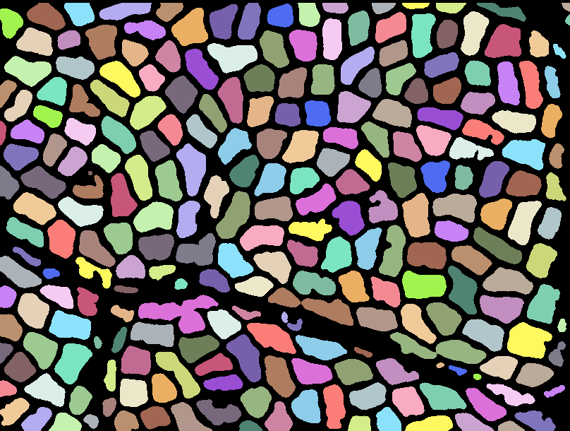
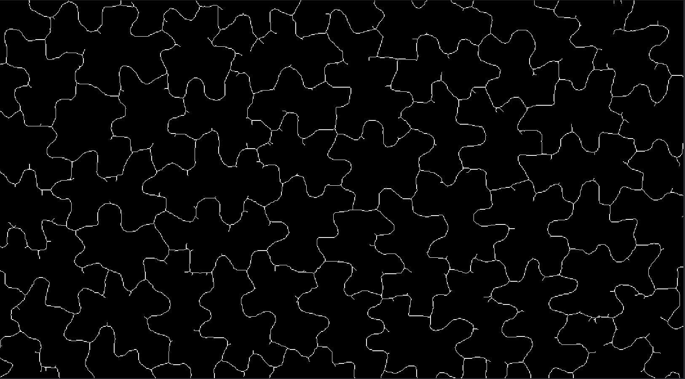
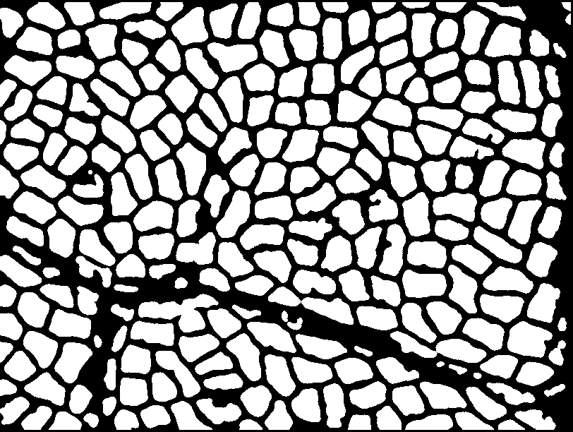
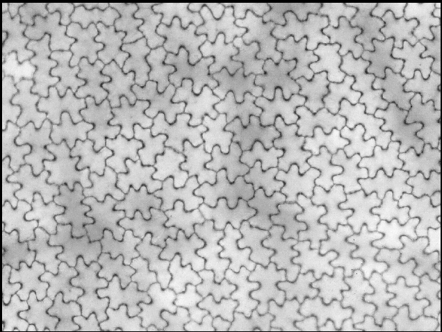
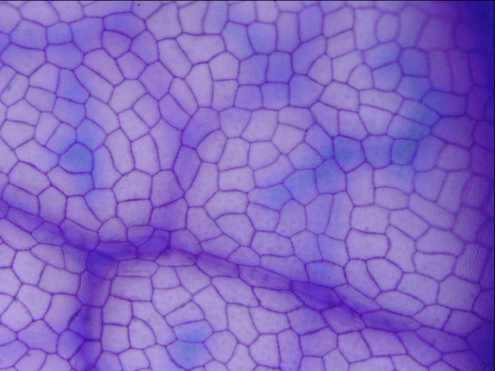

**Analyze leaf epithelium :**

NICOLAS Marine

DEBRUYN Sofia

OUSSADIT Adam

Aleksandra Sapala, Adam Runions, Anne-Lise Routier-Kierzkowska, Mainak Das Gupta, Lilan Hong, Hugo Hofhuis, Stéphane Verger, Gabriella Mosca, Chun-Biu Li, Angela Hay, Olivier Hamant, Adrienne HK Roeder, Miltos Tsiantis, Przemyslaw Prusinkiewicz, Richard S Smith (2018) Why plants make puzzle cells, and how their shape emerges eLife 7:e32794

[https://doi.org/10.7554/eLife.32794](https://doi.org/10.7554/eLife.32794)

**Introduction :**

Plants refers to any of the eukaryotic organisms of the biological kingdom Plantae, characterized by being photosynthetic and having a rigid cell wall. They are living organisms feeding themselves with water and inorganic substances via their roots. The first and viewable surface is the epidermis. In general, the epidermis consists of  one or more layers of cells that form  the protective outer layer of the tegument to prevent the entrance of microorganisms and water loss. In plants, there is generally one thick cell, with simple epidermal cells, guard cells, and hairs. Epidermal cells are divided in three categories :  pavement cells, stomatal guard cells and trichomes. The epidermis also contains stomata. Then we have the epithelium - a membranous tissue consisting of epithelial cells closely packed together and joined by cell junctions. In plants : one example is the endodermis for vascular plants which is a layer of cortical cells tightly joined together. Knowing and studying plant architecture is important to understand plant development - what we want to know in this project, especially the shape of the cells in leaf epithelia.

Furthermore, all plant cells are surrounded by a membrane that separates the cytoplasm from the extracellular matrix and helps in maintaining the cell structure and function and a cell wall that is a structural layer surrounding some types of cells, just outside the cell membrane. It can be tough, flexible, and sometimes rigid. It actually has a multitude of functions upon which plant life depends. Such functions include : providing the living cell with mechanical protection and a chemically buffered environment, providing a porous medium for the circulation and distribution of water, minerals, and other small nutrient molecules… Elsewhere, an important mechanism for plants is the state of a living cell that is expanded by water that has entered it and accumulates in its vacuoles or vesicles. Plant cells need a certain amount of pressure to ensure that the cell wall remains rigid. The pressure exerted by the liquid in the cell pushing against the cell wall is called turgor pressure. We also have microtubules that are filaments of the cytoskeleton involved in major functions such as mitosis or intracellular transport. They are proteinaceous organelles made of subunits of tubulin (one of the most abundant proteins in the cell) forming hollow cylinders. Microtubules are present in nearly all eukaryotic cells and constrain the movement of cellulose synthase complexes, which is important for elongation growth in plants. 

For this week of project, we work on several plant species and their epithelium images. For plants image analysis, we have two different cross sections : adaxial and abaxial. Adaxial is that which is oriented towards the axis of the stem, or indicates a ventral or photosynthetic upper side of a leaf (or vein) facing the axis and/or the stem. As opposed to abaxial, the adaxial side is located near the axis, facing in the direction of the axis. Moreover, cells are often colored with Toluidine blue staining which is a basic thiazine metachromatic dye with high affinity for acidic tissue components, thereby staining tissues rich in DNA and RNA. Use of toluidine blue in tissue sections is done with the aim to highlight components, such as mast cells granules, mucins, and cartilage.

All these images we’ll help us to answer three questions : How are cells connected ? How can we infer the cell expansion direction ? And how many cells are there ? To answer these questions, we’ll work on Jupyter Notebooks

**Python dependencies :** 

**Libraries :**

`scikit-image`		`seaborn`

`matplotlib`		`napari`

`sklearn`		`scipy`

`pandas`		`tifffile`

`numpy`		`glob`

`skimage`

**In the terminal :**

→ `pip install  pandas numpy napari scipy scikit-image matplotlib`

→ `conda install seaborn-c conda-forge`

→`pip install -U scikit-learn

**A "how to use" tutorial for each use case :**

* **How are cells connected ? **

As for the other questions the first step is to classify all your images in folders according to their features which are : “Rondes + veines”, “Stomates”, “Normal”, “Normal + veines”, “ Puzzle”, “Puzzle + veines”, “Puzzle sombre”. The second step is to import all the libraries and functions listed above. Then you will have one cell to run for each group. In this cell you will create the skeleton you see below, create a dataframe with all the non triangular junctions and their centroid coordinates by images and a dataframe with all the images names, total number of junctions, number of non triangular junctions, name of the image csv. After you run the code for each group you have the code to concatenate the 7 dataframes to have the final csv and create the barplot. 

* **How can we infer the cell expansion direction ? **

As for the other questions, the first step is to classify the images in different folders according to some characteristics: “Rondes + veines”, “Stomates”, “Normal”, “Normal + veines”, “ Puzzle”, “Puzzle + veines”, “Puzzle sombre”. Then, the code should be run: it will start by importing all necessary libraries and functions including one .py document that contains all functions written for this specific question. For each group of images you can run the code which will return a DataFrame containing the name of the image, the mean area of it cells and the mean lobeyness. At the end, all those DataFrames are concatenated and the column “Specie” is added. Finally, run the last kernels that will show a more visual representation of the lobeyness and cell area in function of the species.

* **How many cells are there ?**

To count the number of cells, the first step is to classify the images in the different folders : “Rondes + veines”, “Stomates”, “Normal”, “Normal + veines”, “ Puzzle”, “Puzzle + veines”, “Puzzle sombre”.

Then, in the code, first import all the libraries and functions you need and that we listed above. For each group of images, run the code. You will have a DataFrame for each group. We add them in a list to concat them all. At the end we convert it to a csv file.

This is what the code does to count each cell.

**Limitations :**

* **How are cells connected ? **

For use case 2 : “How are cells connected ?”, we had a problem with the image groups “Normal veiness” and “puzzle veines”  where the creation of the mask function returned a quasi empty mask. Due to the deadline we chose to exclude those images from this use case.

* **How can we infer the cell expansion direction ? **

Most limitations are linked to the segmentation, as the result depends on it. Indeed, some images were really hard to precisely segment and we needed to do some concessions because of the limited time. As this question deals directly with the shape of cells which is indicated with the segmentation labels, this lack of precision is particularly important. Furthermore, it could be interesting to have DataFrames containing the information related to all cells instead of a mean area or mean lobyeness per image. This was a shortcut used to simplify the work.

* **How many cells are there ?**

The main limitations of this is that it works for colored images. If we already have a black and white image, we have to remove the step in the segmentation functions “color.rgb2gray(img)” - NB : beware of replacing img_gray by img in the median filter for this case.
Moreover, the code is set for images with the same “zoom” so for a same cell.

